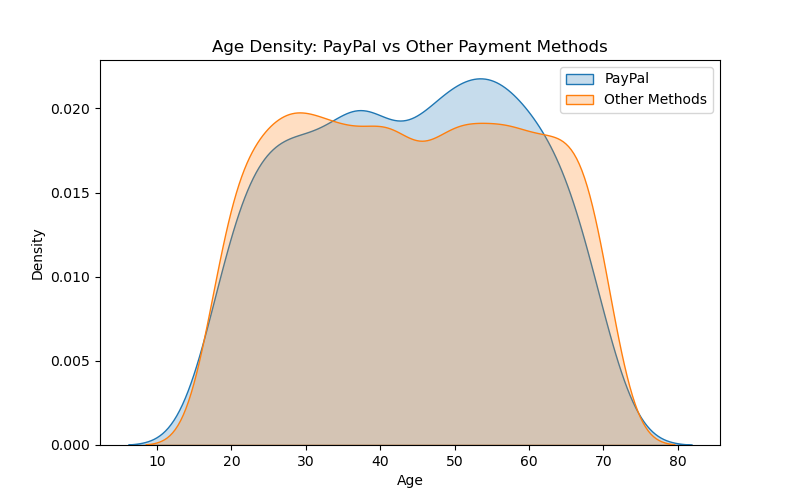
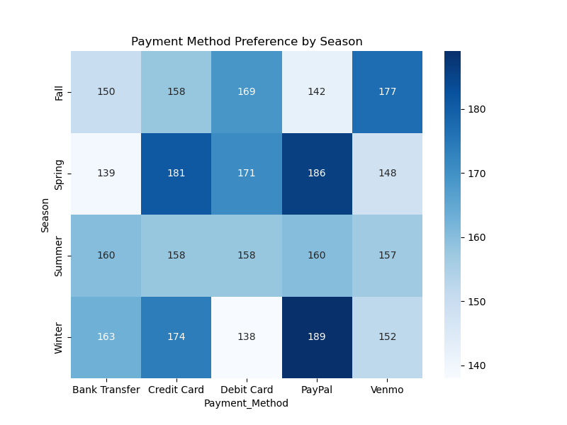

# Capstone Project

## Link to Jupyter Notebook Link -> https://github.com/stephytony/shopping_trend_analyzer/blob/main/payment_analyzer.ipynb

## Introduction : 

This repository contains the Jupyter Notebook for the capstone Project. 

## Project Title : 

Customer Shopping Trend Analysis

## Project Agenda : 

This project aims at identifying the customer shopping trend and purchasing behavior with focussing more on the Payment method used by customers. The goal is to identify the types of customers prefer using PayPal over other payment methods (eg. credit cards, debit cards, Google Pay or Apple Pay).
This helps in identifying who prefers PayPal, when, and why, and businesses can personalize the checkout experience, optimize marketing efforts, and improve payment conversion rates.

## Files explained : 

    1. data/shopping_trends_updated.csv -> Original dataset - 
    https://www.kaggle.com/code/andywow/customer-shopping-trends-analysis 
    2. images -> plots and visualizations
    3. payment_analyzer.ipnyb -> Data analysis - Notebook

## Tools and Libraries : 

    - [pandas](https://pandas.pydata.org/) → data cleaning, preprocessing, grouping  
    - [numpy](https://numpy.org/) → numerical operations  
    - [matplotlib](https://matplotlib.org/) & [seaborn](https://seaborn.pydata.org/) → visualizations  
    - [jupyter notebook](https://jupyter.org/) → interactive exploration 

## Independent Analysis : 
    Analyzed customer shopping behavior to identify PayPal user preferences based on age, season, shipping type, product category, and purchase frequency. Applied data cleaning, feature grouping, and visualization techniques to uncover meaningful patterns in digital payment usage.
   
    - Data cleansing -> Initial data cleaning was performed by removing cash transactions and consolidating multiple shipping methods into two categories: Standard and Express.

    - Exploratory data analysis was conducted across key customer attributes, including age, seasonality, shipping type, product category, and purchase frequency. Visualizations such as boxplots, bar charts, and heatmaps were used to compare PayPal users with customers using other payment methods.

## Results Explained :

    - Age Density of customers using Paypal vs non paypal platforms. This density plot suggests majority of customers are between 50-60
    

    - Seasonal trends reveal that Winter accounts for the largest number of PayPal transactions, followed by Spring. 
    
    
    

## Conclusion : 

The analysis revealed that PayPal is more commonly used by older customers and frequent shoppers, with higher adoption during specific seasons. PayPal users also showed a stronger preference for express shipping and certain product categories, indicating distinct purchasing and delivery behavior compared to other payment methods. Overall, the findings provide actionable insights into customer segmentation and digital payment adoption patterns
