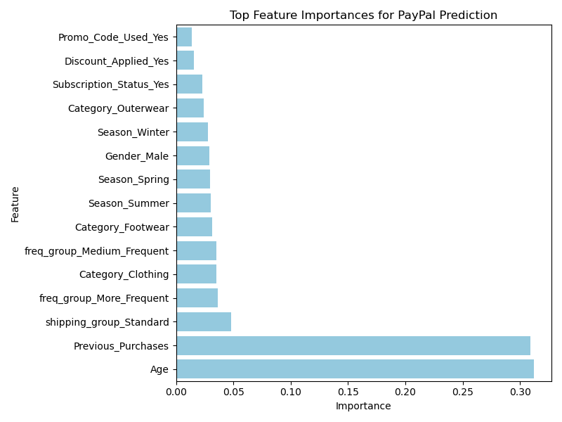
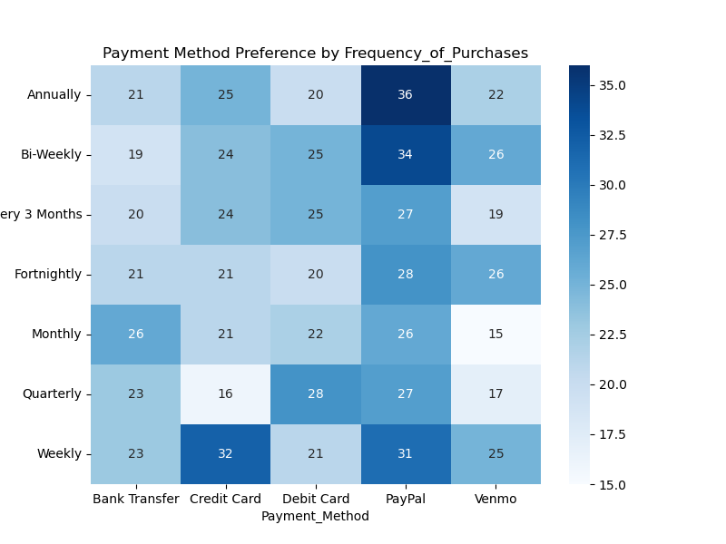

# Capstone Project

## Link to Jupyter Notebooks
Module 24 MODEL -> https://github.com/stephytony/shopping_trend_analyzer/blob/main/payment_model_analyzer.ipynb
Module 20 Analyzer -> https://github.com/stephytony/shopping_trend_analyzer/blob/main/payment_analyzer.ipynb

## Introduction : 

This repository contains the Jupyter Notebook for the capstone Project. 

## Project Title : 

Customer Shopping Trend Analysis

## Project Agenda : 

This project aims at identifying the customer shopping trend and purchasing behavior with focussing more on the Payment method used by customers. The goal is to identify the types of customers prefer using PayPal over other payment methods (eg. credit cards, debit cards, Google Pay or Apple Pay).
This helps in identifying who prefers PayPal, when, and why, and businesses can personalize the checkout experience, optimize marketing efforts, and improve payment conversion rates.

Key insights focus on seasonality, shipping preferences, customer age, purchase frequency, and product categories.

## Files explained : 

    1. data/shopping_trends_updated.csv -> Original dataset - 
    https://www.kaggle.com/code/andywow/customer-shopping-trends-analysis 
    2. images -> plots and visualizations
    3. payment_analyzer.ipnyb -> Data analysis - Notebook Link
    4. payment_model_analyzer.ipnyb -> Model analysis - Notebook Link

## Tools and Libraries : 

    - [pandas](https://pandas.pydata.org/) → data cleaning, preprocessing, grouping  
    - [numpy](https://numpy.org/) → numerical operations  
    - [matplotlib](https://matplotlib.org/) & [seaborn](https://seaborn.pydata.org/) → visualizations  
    - [jupyter notebook](https://jupyter.org/) → interactive exploration 

## Models Used

    Two classification models were trained to predict PayPal usage:

    1. Logistic Regression
    -> Simple, interpretable model
    -> Useful for understanding linear relationships between features and PayPal usage

    2. Random Forest Classifier
    -> Captures nonlinear relationships
    -> Provides feature importance for model interpretation

    Both models were evaluated using cross-validation (5 folds) and Grid Search for hyperparameter tuning.

## Evaluation Metrics

    Accuracy: Measures overall correctness of predictions

    Confusion Matrix: Shows how many PayPal and non-PayPal users were correctly/incorrectly classified

    Feature Importance: Identifies the most influential factors driving PayPal usage

## Model Results
    
    Feature Importance (Top Contributing Features)      Feature	Importance
    Age	                                                0.117
    Previous_Purchases	                                0.115
    shipping_group_Standard	                            0.023
    Category_Clothing	                                0.021
    freq_group_More_Frequent	                        0.020

## Independent Analysis : 
    Analyzed customer shopping behavior to identify PayPal user preferences based on age, season, shipping type, product category, and purchase frequency. Applied data cleaning, feature grouping, and visualization techniques to uncover meaningful patterns in digital payment usage.
   
    - Data cleansing -> Initial data cleaning was performed by removing cash transactions and consolidating multiple shipping methods into two categories: Standard and Express.

    - Exploratory data analysis was conducted across key customer attributes, including age, seasonality, shipping type, product category, and purchase frequency. Visualizations such as boxplots, bar charts, and heatmaps were used to compare PayPal users with customers using other payment methods.

## Results Explained :

Age Density of customers using Paypal vs non paypal platforms. This density plot suggests majority of customers are between 50-60

Seasonal trends reveal that Winter accounts for the largest number of PayPal transactions, followed by Spring. 

Payment method preference varies by shipping type, with PayPal favored for Express and other methods for Standard shipping

Analysis indicates that PayPal users tend to make purchases more frequently compared to customers using other payment methods

 

The analysis of customer shopping behavior reveals several key trends across PayPal and non-PayPal users:

1. Seasonality: Customers show a higher preference for shopping during the winter season, indicating increased demand during this period.

2. Shipping Preference: Express shipping is the most preferred delivery option among shoppers.

3. Customer Age Group: Older customers tend to shop more frequently compared to younger customers.

4. Purchase Frequency: Overall, customers demonstrate a lower frequency of purchases, suggesting infrequent but possibly higher-value transactions.

## Model Interpretation:

    ->Age and Previous Purchases are the strongest predictors of PayPal usage.

    ->Standard shipping, clothing category, and purchase frequency also contribute, though with smaller impact.

    ->This aligns with earlier observations that older customers and purchase history influence PayPal adoption.

## Conclusion :
The analysis of customer shopping behavior, combined with predictive modeling, highlights key factors influencing PayPal adoption among shoppers. Both Random Forest and Logistic Regression models confirmed that Age and Previous Purchases are the strongest predictors of PayPal usage, indicating that older customers with a history of purchases are more likely to choose PayPal.

Other features, such as shipping preference, product category, and purchase frequency, also contribute to prediction, albeit to a lesser extent. The model’s feature importance aligns with observed trends: customers tend to shop more during the winter and spring seasons, favor express shipping, and exhibit lower purchase frequency overall.

These findings provide actionable insights: marketing strategies, seasonal promotions, and payment options can be tailored based on customer age, shopping frequency, and past purchase behavior to enhance engagement and encourage PayPal adoption. Overall, the combination of exploratory analysis and model interpretation offers a robust understanding of customer behavior and highlights the key drivers behind payment method choices.

## Actionable Recommendations

1. Targeted Marketing: Focus campaigns on older customers with purchase history to increase PayPal adoption.

2. Seasonal Promotions: Launch Winter and Spring promotions emphasizing PayPal convenience.

3. Payment Options Optimization: Highlight PayPal during checkout for low-frequency shoppers to increase conversion.

4. Product-Specific Strategies: Promote PayPal usage in high-adoption categories like Clothing.

5. Shipping Strategy Alignment: Consider bundling PayPal incentives with Standard shipping to nudge behavior.

## Next Steps

    Address Class Imbalance: Explore techniques such as SMOTE or weighted models to improve minority class prediction.

    Explore Multiclass Payment Behavior: Extend analysis beyond PayPal vs Non-PayPal to include Venmo, Credit Card, etc.

    Refine Feature Engineering: Incorporate behavioral data like browsing history, cart abandonment, or coupon usage.

    Model Deployment: Build a predictive dashboard for marketing and operations teams to leverage real-time insights.
